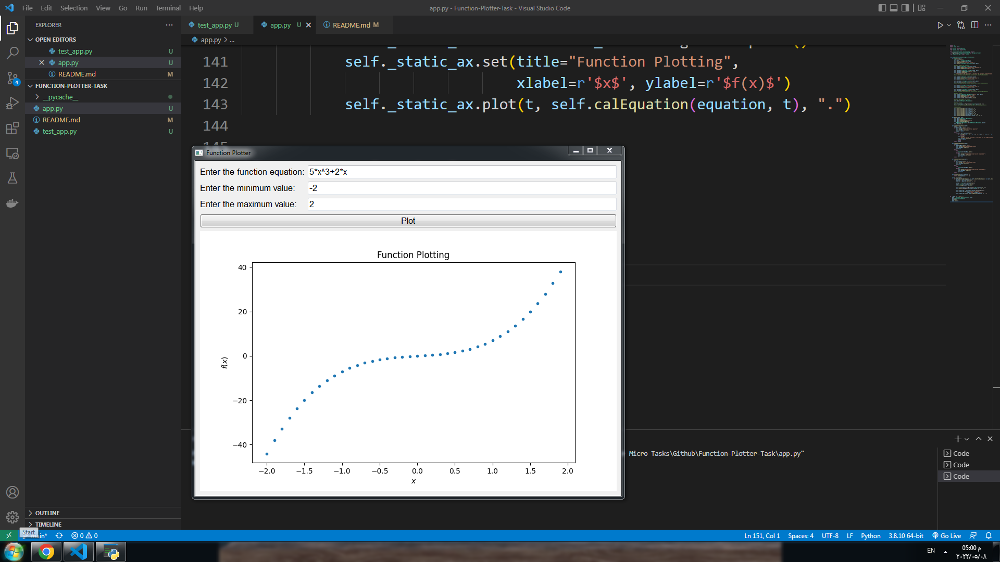
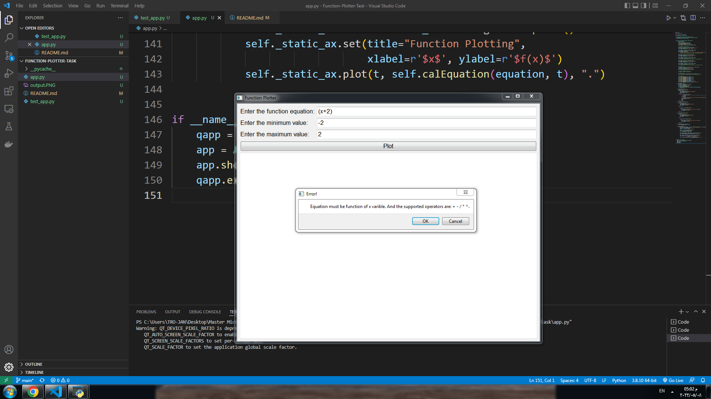

# Python GUI program that plots arbitrary user-entered function using [PySide2](https://pypi.org/project/PySide2/).

### Output Example :
<p align="center" >
  
</p>

### Invalid Entry Example :
<p align="center" >
  
</p>


## Requirments
* App requirments 
```python
pip install PySide2
pip install numpy
pip install matplotlib
pip install os-sys
```
* Testing Requirments
```python
pip install pytest
pip install pytest-qt
```

## Usage

* Run [app.py](app.py) file.
```python
python app.py
```
* For testing, Run [test_app.py](test_app.py) file.
```python
pytest test_app.py
```
